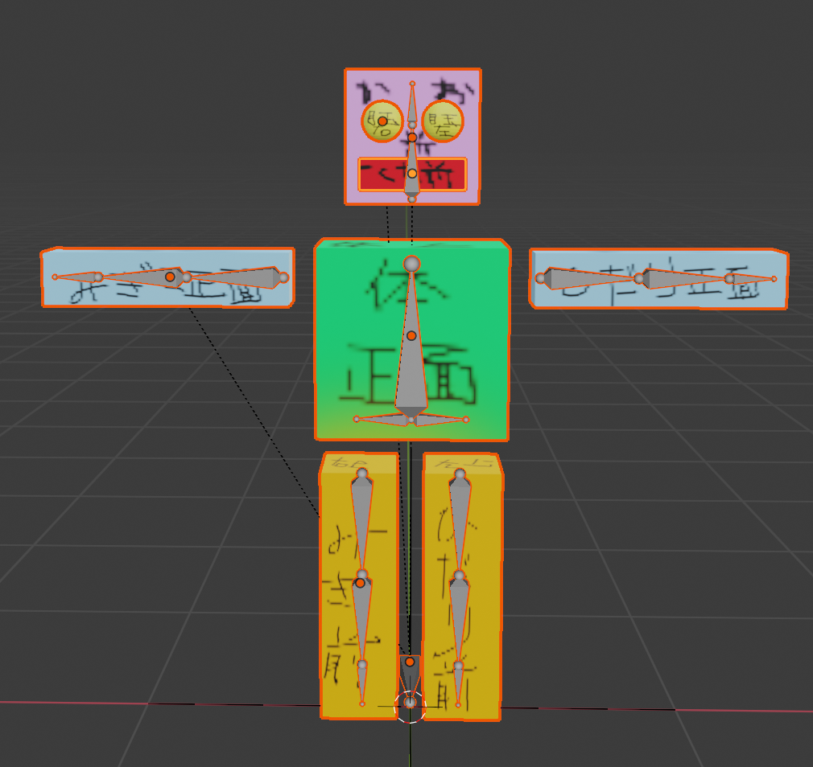
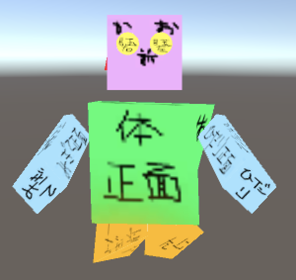
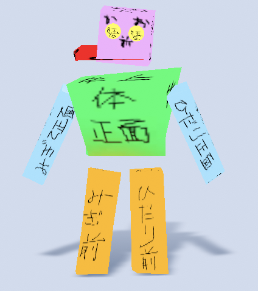

# さんぷる太郎くん

## 概要

Blender -> Unity -> 3tene とデータを変換していく上でどうおかしくなっているかを検証するために生み出されたモデル

## 差分

|Blender|Unity Animation|3tene|
|---|---|---|
||||

さすがにこれでアニメーションの整合性合わせるのは無理ゲーではないか...

## なぜこうなっているかの考察

3tene は少し斜めむけたほうがいい感じだからかなと推測

Unity Animation は意味不明
